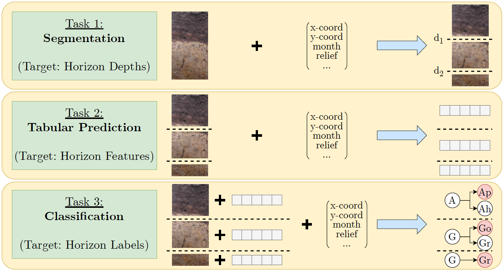
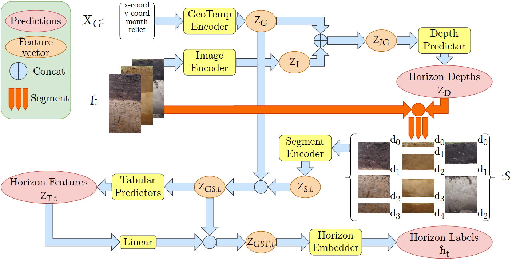
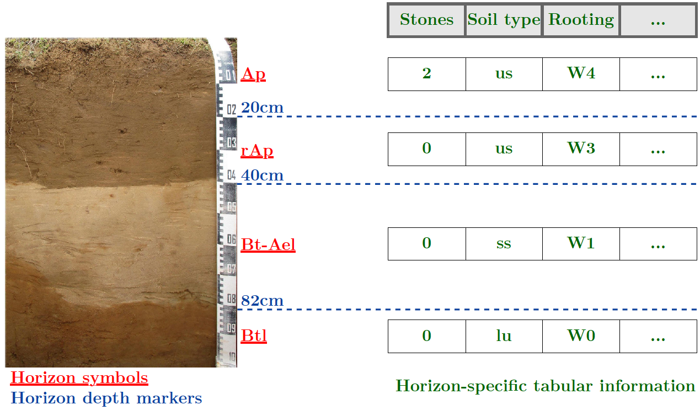

# SoilNet: A Multimodal Multitask Model for Hierarchical Classification of Soil Horizons
Submitted to the 39th Conference on Neural Information Processing Systems (NeruIPS 2025)

**Authors:** Anonymized Authors

---

## Table of Contents

* [Abstract](#abstract)
* [Project Overview](#project-overview)
* [Installation](#installation)
* [Dataset](#dataset)
* [Usage](#usage)
    * [Training](#training)
    * [Evaluation](#evaluation)
* [Results](#results)
* [Repository Structure](#repository-structure)

---

## Abstract

While recent advances in foundation models have improved the state of the art in many domains, some problems in empirical sciences could not benefit from this progress yet. Soil horizon classification, for instance, remains challenging because of its multimodal and multitask characteristics and a complex hierarchically structured label taxonomy. Accurate classification of soil horizons is crucial for monitoring soil health, which directly impacts agricultural productivity, food security, ecosystem stability and climate resilience. In this work, we propose *SoilNet* - a multimodal multitask model to tackle this problem through a structured modularized pipeline. Our approach integrates image data and geotemporal metadata to first predict depth markers, segmenting the soil profile into horizon candidates. Each segment is characterized by a set of horizon-specific morphological features.

Finally, horizon labels are predicted based on the multimodal concatenated feature vector, leveraging a graph-based label representation to account for the complex hierarchical relationships among soil horizons. Our method is designed to address complex hierarchical classification, where the number of possible labels is very large, imbalanced and non-trivially structured. We demonstrate the effectiveness of our approach on a real-world soil profile dataset.

---

## Project Overview



1. **Task 1: Segmentation**: Soil profile images are segmented based on features extracted from the full images concatenated with features extracted from the geotemporal data.

2. **Task 2: Tabular Prediction**: Tabular morphological features are predicted based on (visual) features extracted from the segments concatenated with the geotemporal features (one set of tabular features per segment).

3. **Task 3: Classification**: Horizon labels are predicted based on concatenated visual segment features, geotemporal features and tabular morphological features (one label per segment).

### An illustration of our proposed modularized multimodal multitask architecture for solving the three tasks (SoilNet):


---

## Installation

1.  **Clone the repository:**
    ```bash
    git clone ...
    ```

2.  **Create a virtual environment (recommended):**
    ```bash
    # Using venv
    python -m venv env
    source env/bin/activate # On Windows use `env\Scripts\activate`
    ```

3.  **Install dependencies:**
    ```bash
    # Using pip
    pip install -r requirements.txt
    ```
    *Note: The key dependency for running the models is PyTorch with version 2.1.0 and CUDA 12.1.*

---

## Dataset

For carrying out the experiments and training our models we disposed of an image-tabular dataset built and curated by our partner geological institute *(Reference anonymized)*.

**For the time being, the full dataset cannot be made publicly available.**

However, the following figure demonstrates the data structure of the dataset we used for training and evaluation:



Additionally the dataset contained geotemporal metadata for each soil profile image. For further details on the dataset, please refer to the paper.

---

## Usage

The repository's code can be used through running the `main.py` script. The script allows for training, and inference of the SoilNet model and submodules.

To see all available command line arguments, run:
```bash
python main.py --help
```

### Training
To train a model, use the following command:
```bash
python main.py --data_folder_path=<path_to_data_folder> --target=<target> --experiment_type=<experiment_name>
```
Where:
- `<path_to_data_folder>`: Path to the folder containing the dataset.
- `<target>`: The target task to train the model on.
- `<experiment_name>`: Name of the experiment, see [experiments](bgr/soil/experiments/)

### Evaluation
To evaluate a trained model, provide a path to the model checkpoint and the data folder:
```bash
python main.py --data_folder_path=<path_to_data_folder> --target=<target> --experiment_type=<experiment_name> --inference_model_file=<path_to_model_checkpoint>
```
Where:
- `<path_to_data_folder>`: Path to the folder containing the dataset.
- `<target>`: The target task to evaluate the model on.
- `<experiment_name>`: Name of the experiment, see [experiments](bgr/soil/experiments/)
- `<path_to_model_checkpoint>`: Path to the model checkpoint for the specfied experiment.

# Results
The results of our experiments are presented in the paper, for further details please refer to the paper.

Here we provide a summary of the results for the SoilNet (SN) model with 4 different configurations. Metrics are computed on the test set and given in percents (%).  The full images for the depth module were encoded with the *MaskedResNet* image encoder. *PatchCNN* and *ResNet* refer to the segment encoders. *LSTM* refers to all three task-predictors (depth, tabulars, horizons). *Emb* and *CE* refer to the horizon loss, SN = SoilNet, Acc.agg. = Accuracy aggregated over main symbols. The main symbols represent the horizon symbols on a higher level of the hierarchy, demonstrating more geologically coherent predictions.

| Model name              | IoU            | Acc.           | F1             | Prec.          | Rec.           | Acc.@5         | Prec.@5        | Rec.@5         | Acc.agg.       |
| :---------------------- | :------------- | :------------- | :------------- | :------------- | :------------- | :------------- | :------------- | :------------- | :------------- |
| SN_PatchCNN_LSTM_Emb    | 51.25          | 36.27          | 7.55           | **10.40** | **10.48** | 60.21          | 40.27          | 33.84          | **71.42** |
| SN_ResNet_LSTM_Emb      | **51.47** | 35.40          | 6.58           | 8.51           | 9.48           | 59.65          | 33.75          | 33.08          | 68.70          |
| SN_PatchCNN_LSTM_CE     | 49.52          | 43.99          | 7.20           | 9.03           | 8.26           | 72.02          | **50.33** | 30.33          | 68.61          |
| SN_ResNet_LSTM_CE       | 49.91          | **45.70** | **7.99** | 9.22           | 8.62           | **76.25** | 49.85          | **35.03** | 69.88          |

# Repository Structure
The repository is structured as follows (*only relevant files displayed*):

* [`bgr/`](./bgr/):
    * [`soil/`](./bgr/soil/)
        * [`data/`](./bgr/soil/data/)
            * [`datasets.py`](./bgr/soil/data/datasets.py): PyTorch datasets used in the experiments, Images will be loaded here using file paths stored in the tabular data.
            * [`horizon_tabular_data.py`](./bgr/soil/data/horizon_tabular_data.py): Loading and processing of the dataset in a tabular format.
        * [`experiments/`](./bgr/soil/experiments/)
            * [`simple_depth/`](./bgr/soil/experiments/simple_depth/): Experiments for the depth marker prediction task (**Task 1**).
            * [`simple_tabulars/`](./bgr/soil/experiments/simple_tabulars/): Experiments for the tabular horizon feature prediction task (**Task 2**).
            * [`simple_horizon/`](./bgr/soil/experiments/simple_horizon/): Experiments for the horizon classification task (**Task 3**).
            * [`end2end/`](./bgr/soil/experiments/end2end/): Experiments for the end-to-end SoilNet model (**Task 1, 2 and 3**).
        * [`modelling/`](./bgr/soil/modelling/)
            * [`depth/`](./bgr/soil/modelling/depth/): Models and modules for the depth marker prediction.
            * [`tabulars/`](./bgr/soil/modelling/tabulars/): Models and modules for the tabular horizon feature prediction.
            * [`horizon/`](./bgr/soil/modelling/horizon/): Models and modules for the horizon classification.
            * [`geotemp_modules.py`](./bgr/soil/modelling/geotemp_modules.py): Modules for the processing / encoding of the geotemporal data.
            * [`image_modules.py`](./bgr/soil/modelling/image_modules.py): Modules for the processing of the images and segments images.
            * [`soilnet.py`](./bgr/soil/modelling/soilnet.py): The SoilNet model, which integrates all the modules for the three tasks.
        * [`experiment_runner.py`](./bgr/soil/experiment_runner.py): The experiment runner, which handles the training and evaluation of the models.
        * [`metrics.py`](./bgr/soil/metrics.py): The custom metrics used in the experiments.
        * [`training_args.py`](./bgr/soil/training_args.py): The training arguments for the experiments, including hyperparameters for the models.
* [`notebooks/`](./notebooks/)
    * [`soil/`](./notebooks/soil/): Jupyter notebooks for the experiments, including data exploration and visualization.
* [`main.py`](./main.py): The main script and entry point for the repository.
* [`requirements.txt`](./requirements.txt): The requirements file for the repository, including all dependencies.

